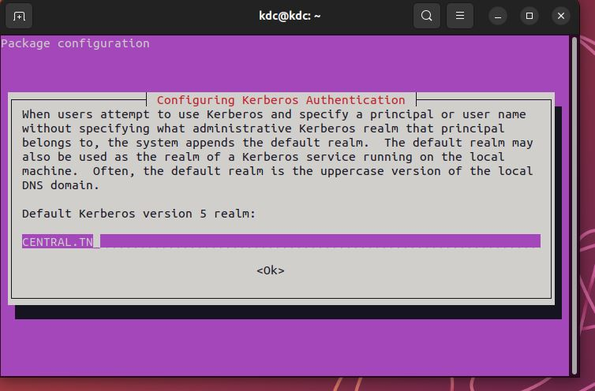
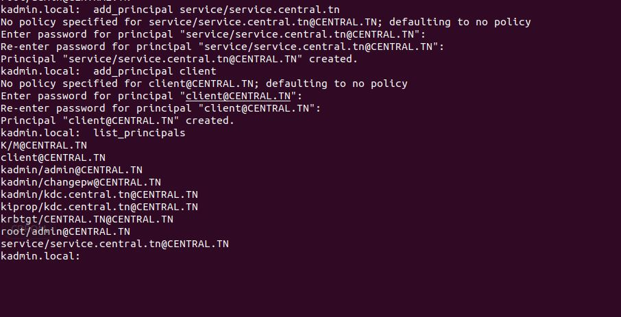

#  Configuration de CUPS( serveur d'impression) pour l'authentification Kerberos

CUPS implémente Kerberos sur HTTP en utilisant GSSAPI et les noms de service/principal "host/server.example.com" pour l'accès en ligne de commande et "HTTP/server.example.com" pour l'accès Web, où "server.example.com " est remplacé par le nom d'hôte de votre serveur CUPS. En raison des limitations de l'extension de protocole HTTP GSSAPI, un seul domaine/KDC est pris en charge pour l'authentification. L'extension HTTP est décrite dans RFC 4559 . Dans notre cas on utiliser kerberos pour l'authentification pour l'accès Web.

##  Introduction kerberos

Kerberos est un réseau *protocole d'authentification* utilisé pour vérifier l'identité de deux ou plusieurs *hôtes de confiance* sur un *réseau non approuvé* . Il utilise la *cryptographie à clé secrète* et un *tiers de confiance* (Kerberos Key Distribution Center) pour authentifier les applications client-serveur. Le centre de distribution de clés (KDC) donne aux clients des tickets représentant leurs informations d'identification réseau. Le ticket Kerberos est présenté aux serveurs une fois la connexion établie.


Les prérequis suivants doivent être satisfaits pour une configuration Kerberos opérationnelle :

Network Time Protocol (NTP) : les clients doivent se synchroniser avec le même serveur de temps pour éviter les échecs d'authentification Kerberos de décalage temporel.<br>
Résolution de nom de domaine (DNS) : les clients doivent avoir un enregistrement SRV enregistré auprès du serveur DNS interne. Il devrait être possible de résoudre tous les participants à l'aide de la recherche directe et inversée. 

###  Nom d'hôte et adresses IP

Nous aurons besoin de trois machines. Dans mon cas, j'utilise trois machines ***ubuntu*** : trois machines virtuelles à l'intérieur de VMware.

Les machines virtuelles ont un adaptateur NAT par défaut, mais pour **attribuer des adresses IP** à ces machines, nous devrons ajouter manuellement un **adaptateur hôte uniquement** .


Nous pouvons vérifier les adresses IP des trois machines en exécutant `hostname -I` sur chacune d'elles.

Dans notre cas :

* L'adresse IP de la machine cliente (client) est **192.168.27.141**
* L'adresse IP de la machine du serveur d'impression (service) est **192.168.27.143**
* L'adresse IP de la machine KDC (serveur kerberos) est **192.168.27.142**
image


Maintenant que nous avons ajouté des adresses IP aux machines virtuelles, nous allons commencer par définir des noms d'hôtes pour chaque machine :

* Machine KDC       
      `hostnamectl --static set-hostname kdc.central.tn`


  
* Serveur de service        
      `hostnamectl --static set-hostname service.central.tn`


  
* Machine cliente      
      `hostnamectl --static set-hostname client.central.tn`


Et *ouvrez un nouveau terminal pour que les modifications prennent effet.*

*On peut vérifier le nom d'hôte d'une machine en exécutant la commande : `hostname` *

Ensuite, nous mapperons ces noms d'hôte à leurs adresses IP correspondantes sur les trois machines à l'aide du fichier */etc/hosts* . <br>
  `sudo vi /etc/hosts`
  
Maintenant, nous devrions définir les informations ci-dessous sur */etc/hosts*  **pour les trois machines**  avec `sudo vi /etc/hosts`:

    <192.168.27.141> kdc.central.tn kdc
    <192.168.27.143> service.central.tn service
    <192.168.27.142> client.central.tn client


Une fois la configuration terminée, nous pouvons vérifier si tout fonctionne correctement en utilisant la commande `nslookup` pour **interroger le DNS** pour obtenir le mappage que nous venons de faire et la commande `ping` pour nous assurer que les trois machines sont joignables .

Voici un exemple sur la machine cliente :


###  Configuration de la machine du centre de distribution de clés

Voici les packages qui doivent être installés sur la machine KDC : <br>
```
    $ sudo apt-obtenir la mise à jour
    $ sudo apt-get install krb5-kdc krb5-admin-server krb5-config
```
 
Lors de l'installation, il nous sera demandé la configuration de :

 * le domaine : 'CENTRAL.TN' (doit être *tout en majuscule* )



 * le serveur Kerberos : 'kdc.central.tn'


 * le serveur d'administration : 'kdc.central.tn'


 
***Realm** est un réseau logique, similaire à un domaine, auquel appartiennent tous les utilisateurs et serveurs partageant la même base de données Kerberos.*
La clé principale de cette base de données KDC doit être définie une fois l'installation terminée :
   
```
sudo krb5_newrealm
```


*Les utilisateurs et les services d'un domaine sont définis comme un **principal** dans Kerberos.* Ces principaux sont gérés par un *utilisateur administrateur* que nous devons créer manuellement :
```
    $ sudo kadmin.local
    kadmin.local : add_principal root/admin
```


[kadmin.local](https://web.mit.edu/kerberos/krb5-1.12/doc/admin/admin_commands/kadmin_local.html) est un programme d'administration de base de données KDC. Nous avons utilisé cet outil pour créer un nouveau principal dans le domaine CENTRAL.TN (`add_principal`).
Nous pouvons vérifier si l'utilisateur *root/admin* a bien été créé en exécutant la commande : `kadmin.local: list_principals`. Nous devrions voir le principal 'root/admin@Central.TN' répertorié avec d'autres principaux par défaut.


Ensuite, nous devons accorder tous les droits d'accès à la base de données Kerberos au principal administrateur *root/admin* en utilisant le fichier de configuration */etc/krb5kdc/kadm5.acl* . <br>
`sudo vi /etc/krb5kdc/kadm5.acl`
Dans ce fichier, nous devons ajouter la ligne suivante :<br>
    */admin@Central.TN *


Après avoir effectué ces modifications dans le fichier de configuration, redémarrez le serveur kerberos en exécutant la commande suivante : : `sudo service krb5-admin-server restart`
Une fois que l'utilisateur admin qui gère les principaux est créé. Nous allons créer des principaux pour la machine cliente et la machine serveur de service (cups).
**Créer un mandant pour le client**
```
    $ sudo kadmin.local
    kadmin.local : add_principal client.central.tn@CENTRAL.TN
```

**Créer un principal pour le serveur de service(cups)**
```    
         
kadmin.local : add_principal -randkey service/service.central.tn@CENTRAL.TN

quit
```

    
*Nous pouvons voir  la liste des principaux en lançant la commande : `kadmin.local: list_principals`* <br>

### Configuration de la machine du serveur de service
#### Configuration de Kerberos
##### Installation des packages  
Voici les packages qui doivent être installés sur la machine du serveur de service : <br>
```
$ sudo apt-obtenir la mise à jour
$ sudo apt-get install krb5-user libpam-krb5 libpam-ccreds
```
 
Lors de l'installation, il nous sera demandé la configuration de :

* le domaine : 'CENTRAL.TN' (doit être *tout en majuscules*)
* le serveur Kerberos : 'kdc.central.tn'
* le serveur d'administration : 'kdc.central.tn'
PS : *Nous devons entrer les mêmes informations que celles utilisées pour le serveur KDC.*
##### Préparation du *fichier keytab*
Nous devons extraire le principal du service de la base de données des principaux KDC dans un fichier keytab.
1. Dans la machine KDC, exécutez la commande suivante pour générer le fichier keytab dans le dossier actuel :
```
   $ ktutil
   ktutil : add_entry -password -p service/service.central.tn@CENTRAL.TN -k 1 -e aes256-cts-hmac-sha1-96
   Mot de passe pour service/service.central.tn@CENTRAL.TN :
   ktutil : wkt service.keytab
```


Utilisez l' utilitaire kadmin pour ajouter les clés des principaux de serveur CUPS au fichier keytab du système.

sudo kadmin -p admin/admin
ktadd -k  /etc/service.keytab service/service.central.tn@CENTRAL.TN
quit

2. Envoyez le fichier keytab de la machine KDC vers la machine du serveur de service :
Dans la machine serveur cups créez les répertoires suivants :
   
   `mkdir -p /home/service/`
Dans la machine KDC, envoyez le fichier keytab au serveur  :<br>
   `scp service.keytab service@<service.central.tn>:/home/service/`

! Nous avons besoin d'avoir le package **openssh-server** installé sur le serveur de service : `sudo apt-get install openssh-server`.
   


3. Vérifiez que le principal du service a bien été extrait de la base de données KDC :
    1. Lister la liste de clés actuelle
        `ktutil : liste`
    2. Lire un keytab krb5 dans la liste de clés actuelle
        `ktutil : read_kt home/service/service.keytab`
    3. Lister à nouveau la liste de clés actuelle
        `ktutil : liste`


remarque le nom de fichier keytab c'est service n'est pas cups commme

#### Configuration du serveur d'impression notre service cups  cupsd.conf
##### Installation de cups
1. Mettre à jour les listes de packages
 
   `sudo apt-obtenir la mise à jour`
 
2. Installez les packages nécessaires pour cups
   `sudo apt-get install cups - y `
3. Assurez-vous que le service est démarré
   `sudo systemctl start cups`
4. Activer le service d'impression CUPS
   `sudo systemctl enable cups`

#####  Mettre à jour les fichiers de configuration de cups :
Pour configurer le serveur d'impression CUPS, ouvrez son fichier de configuration avec n'importe quel éditeur de texte de votre choix (de préférence l'éditeur nano, car c'est l'éditeur de texte par défaut de Linux). Ensuite, configurez le serveur d'impression CUPS en exécutant la commande suivante dans le terminal  pour que le Serveur autorise la connexion depuis le réseau  :
`sudo nano /etc/cups/cupsd.conf `
Le fichier de configuration du serveur d'impression CUPS est illustré dans l'image ci-dessous :


Faites défiler vers le bas et recherchez la section "Afficher les imprimantes partagées sur le réseau local". Ici, vous trouverez une entrée intitulée "Navigation désactivée". Remplacez-le par « Navigation activée », comme illustré dans l'image suivante :


Ensuite, recherchez la section "Écouter uniquement les connexions de la machine locale". Ici, il y aura une entrée intitulée "Écoutez localhost: 631". Remplacez-le par "Port 631", comme indiqué dans l'image ci-dessous :


Maintenant, recherchez la section "Restreindre l'accès au serveur" et ajoutez la ligne "Autoriser @LOCAL" après la ligne "Order allow, deny", comme illustré dans l'image suivante :


Enfin, trouvez la section « Restreindre l'accès aux pages d'administration » et apportez les modifications nécessaires dans cette section, comme indiqué dans l'image ci-dessous :


Nous devrons également activer l'authentification Kerberos en sélectionnant le type d'authentification Négocier . La manière la plus simple de procéder consiste à utiliser la commande cupsctl sur votre ou vos serveurs :
   `cupsctl DefaultAuthType=Negotiate`

Après avoir effectué ces modifications dans le fichier de configuration, redémarrez le service d'impression CUPS
`sudo systemctl restart cups`


### Configuration de la machine cliente 
Voici les packages qui doivent être installés sur la machine Client : <br>
```
$ sudo apt-obtenir la mise à jour
$ sudo apt-get install krb5-user libpam-krb5 libpam-ccreds
```
 
Lors de l'installation, il nous sera demandé la configuration de :
* le domaine : 'Central.TN' (doit être *tout en majuscules*)
* le serveur Kerberos : 'kdc.central.tn'
* le serveur d'administration : 'kdc.central.tn'
PS : *Nous devons entrer les mêmes informations que celles utilisées pour le serveur KDC.*
## Authentification d'utilisateur
Une fois la configuration terminée, il est temps pour le client de s'authentifier à l'aide de Kerberos.
Essayez d'abord de vous ouvrez un navigateur sur l'hôte client et accédez à l'interface Web d'administration CUPS :
`https://service.central.tn:631/admin` 


Jusqu'à présent, CUPS a été invité à utiliser Kerberos comme protocole d'authentification par défaut. De plus, 

Tout d'abord, le navigateur doit être configuré pour prendre en charge l'authentification Kerberos. . De plus, vérifiez que l'interface Web CUPS est activée en définissant la directive WebInterface sur Oui dans /etc/cups/cupsd.conf

sudo systemctl restart cups
À ce stade, sur un hôte client, ouvrez une session de terminal et obtenez un ticket pour un utilisateur Kerberos.


kinit client


Ensuite, ouvrez un navigateur sur l'hôte client et accédez à l'interface Web d'administration CUPS, ( https://service.central.tn:631/admin ). Veuillez noter que l'auteur a jugé nécessaire de spécifier un nom de domaine complet pour le serveur CUPS. À ce stade, l'utilisateur principal doit être authentifié et l'interface Web d'administration affichée.


Dans une session de terminal sur l'hôte client, détruisez le ticket Kerberos :

kdestroy -A
Maintenant, accédez à nouveau à l'interface Web d'administration CUPS sur l'hôte client. Cette fois, une erreur devrait s'afficher car il n'y a pas de ticket d'authentification Kerberos valide.

###Les références :<br>
https://github.com/yosra270/postgresql-auth-with-kerberos<br>
https://linuxhint.com/cups_print_server_ubuntu<br>
https://www.cups.org/doc/kerberos.html<br>
https://roughlea.wordpress.com/linux-administration/configuring-cups-for-kerberos-authentication/
